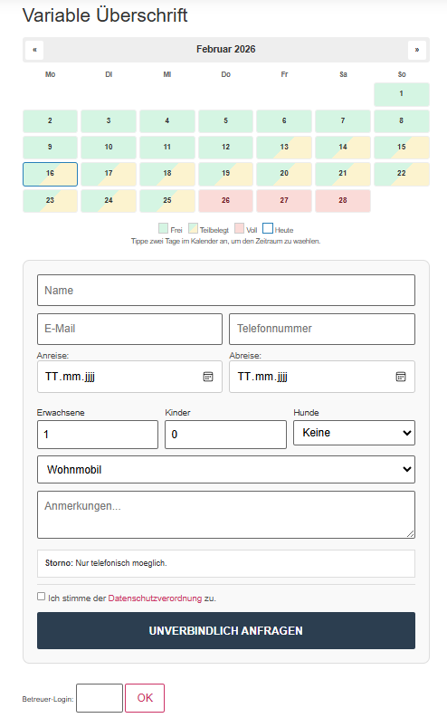
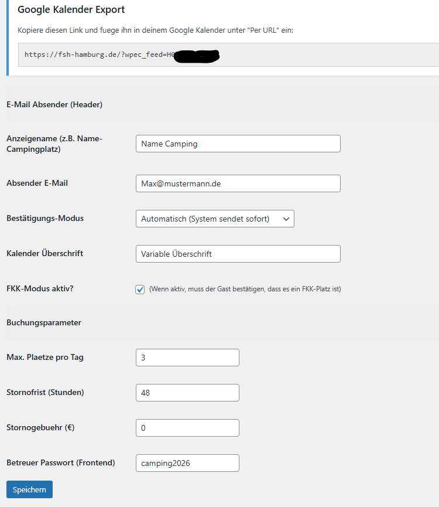
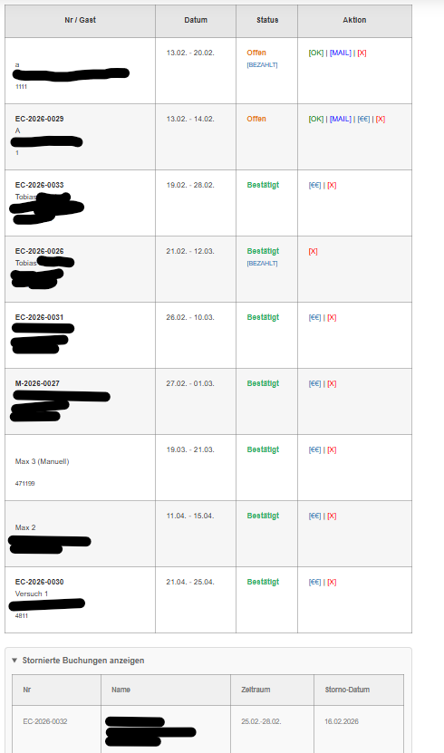

# WP EasyCamp Booking 🏕️

Ein leichtgewichtiges, aber leistungsstarkes Buchungssystem für Campingplätze und Vereine. Inklusive Belegungsprüfung, iCal-Export und einem Betreuer-Modus.

## ✨ Hauptmerkmale

- **Interaktiver Kalender:** Gäste wählen den Zeitraum direkt per Klick.
- **Echtzeit-Verfügbarkeit:** Automatische Prüfung gegen Überbuchungen (einstellbare Slots).
- **iCal-Synchronisation:** Exportiere Buchungen direkt in den Google Kalender.
- **Frontend-Management:** Betreuer können Buchungen direkt auf der Seite verwalten (Login ohne WordPress-Backend nötig).
- **Validierung:** Verhindert Buchungen in der Vergangenheit oder ungültige Datumsbereiche.

## 🚀 Installation

- per .Zip Datei:
  1. Lade die Datei WP-EasyCamp-booking.zip und installiere in Wordpress-Backend damit das PlugIn.
  2. Aktiviere das Plugin im WordPress-Backend.
  3. Konfiguriere die Einstellungen unter dem Menüpunkt **EasyCamp**.
  4. Nutze den Shortcode `[easycamp_form]` auf einer beliebigen Seite.

- Installation per FTP: 
1. Erstelle den Ordner `wp-easycamp-booking` in deinem Verzeichnis `/wp-content/plugins/` und lade alle Dateien hinein.
2. Aktiviere das Plugin im WordPress-Backend.
3. Konfiguriere die Einstellungen unter dem Menüpunkt **EasyCamp**.
4. Nutze den Shortcode `[easycamp_form]` auf einer beliebigen Seite.

## 🛠️ Konfiguration & Shortcodes

| Shortcode | Beschreibung |
| :--- | :--- |
| `[easycamp_form]` | Zeigt den Kalender und das Buchungsformular an. |

### Einstellungen
In den globalen Einstellungen kannst du folgende Parameter definieren:
- Maximale Stellplätze pro Tag
- Stornofristen und Gebühren
- Betreuer-Passwort für den Frontend-Zugang
- E-Mail-Absender Informationen

## 📸 Screenshots

### 1. Buchungsformular

### 2. Admin-Einstellungen

### 3. Betreuer-Ansicht

## 📄 Lizenz

Dieses Plugin steht unter der [GPLv2](http://www.gnu.org/licenses/gpl-2.0.html).

## ☕💸 Buy me a Coffee Link
https://www.paypal.com/paypalme/Tobsta

---
*Entwickelt von Hornburg-Webdesign.*
